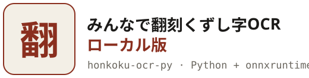
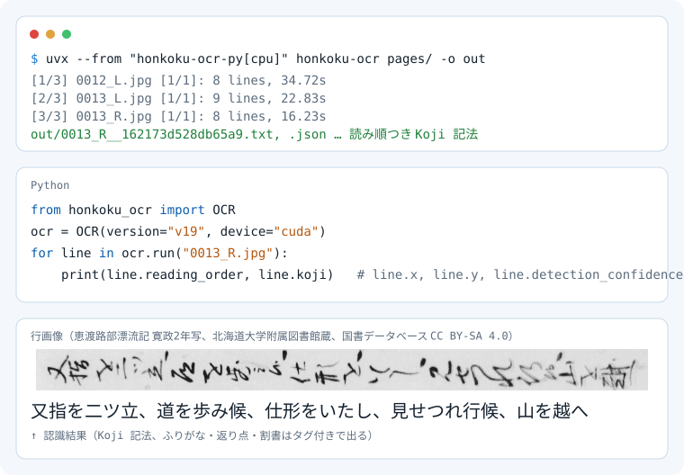

<div align="center">

<picture>
  <source media="(prefers-color-scheme: dark)" srcset="./docs/logo-dark.svg">
  <source media="(prefers-color-scheme: light)" srcset="./docs/logo-light.svg">
  
</picture>

**ブラウザ版「みんなで翻刻OCR」のPython移植。くずし字画像をコマンドラインで一括翻刻。**

[](./LICENSE)
[](./NOTICE.md)
[](./pyproject.toml)
[](https://onnxruntime.ai/)
[](#性能)
[](https://yuta1984.github.io/honkoku-ocr-web/tech.html)
[](./tests)
[](https://github.com/yuta1984/honkoku-ocr-web)

</div>

<p align="center">
<picture>
  <source media="(prefers-color-scheme: dark)" srcset="./docs/demo-dark.svg">
  <source media="(prefers-color-scheme: light)" srcset="./docs/demo-light.svg">
  
</picture>
</p>

[みんなで翻刻OCR](https://yuta1984.github.io/honkoku-ocr-web/)（橋本雄太、CC BY 4.0）の推論パイプラインをPythonおよびonnxruntimeへ移植した実装である。ブラウザ版と同じモデルと前処理を用い、くずし字の古典籍画像からKoji記法（ふりがな・返り点・送り仮名・割書のタグを含む「みんなで翻刻」の記法）の翻刻テキストを出力する。幾何変換・正規化・復号の手順は原実装に準拠しているが、拡大縮小と回転の補間にPillowを用いているため、画素値は完全には一致しない。

A Python port of the inference pipeline ofみんなで翻刻OCR (honkoku-ocr-web, by Yuta Hashimoto,
CC BY 4.0). Same models, same geometry and normalisation, same output notation; no browser, no UI, and it runs
on a GPU through onnxruntime's CUDA provider. Resampling is Pillow's, so tensors are equivalent rather than bit-identical.

## 構成

| 段階 | 実装 | 由来 |
|------|------|------|
| 行検出 | RTMDet-s、入力1024×1024レターボックス、入れ子box除去 | NDL古典籍OCR-Liteのモデル、honkoku-ocr-webの前後処理 |
| 読み順 | XY-Cut（縦書きは右の段から左へ） | NDL古典籍OCR-Lite / honkoku-ocr-web |
| 行認識 | ConvNeXt V2 encoder (fp16) + RoBERTa decoder (int8、KVキャッシュ)、greedy、語彙7,710 | honkoku-ocr-web kuzushiji-v18（v17, v16fsも選択可） |
| 出力 | 特殊トークン列 → Koji記法 / 素テキスト | honkoku-ocr-web |

モデルの設計・学習・評価の詳細は[docs/tech.html](docs/tech.html)（原著作物の技術情報ページの複製）を参照。

## 比較

| | **honkoku-ocr-py** | [みんなで翻刻OCR](https://yuta1984.github.io/honkoku-ocr-web/)（ブラウザ版） | [NDL古典籍OCR-Lite](https://github.com/ndl-lab/ndlkotenocr-lite) |
| :-- | :-: | :-: | :-: |
| 動く場所 | Python / CLI / サーバ | ブラウザ（WebAssembly, Web Worker） | Python / デスクトップアプリ |
| 一括処理 | ✅ディレクトリ単位、スクリプトから呼べる | ❌画像を開いてボタンを押す | ✅ディレクトリ単位 |
| GPU | ✅ CUDA（encoder） | WebGPU対応端末のみ | CUDA（ベータ） |
| 行認識モデル | ConvNeXt V2 + RoBERTa（kuzushiji v18） | 同じ | PARSeq |
| 出力 | Koji記法（ふりがな・返り点・送り仮名・割書のタグ付き）+ JSON | Koji記法、縦書き表示 | 素テキスト + XML/JSON |
| 行位置の持ち込み | ✅ `run(image, boxes=...)` | 画面上でbboxを編集 | ❌ |
| 行bboxの編集UI | ❌ | ✅ | ❌ |
| モデルの検証 | サイズとSHA-256を照合 | IndexedDBキャッシュ | 同梱 |
| 精度（原著の公表値） | 本文plain micro CER 0.075（v18） | 同じ | NDL古典籍OCR ver.3より約2% 低い |

ブラウザ版は行bboxの手動調整や縦書き閲覧に適している。本移植は自動処理、大量処理、他ツールとの連携を担う。

## なぜ移植したか

ブラウザ版は1枚ずつ画像を開いて手動実行するUIであり、多数の写本画像を機械的に処理する用途には適さない。このリポジトリでは同じモデルを用い、以下の機能を提供する。

- **一括処理**: ディレクトリを指定して全画像を順次翻刻し、画像ごとにKoji記法のtxtと、行位置・読み順・認識スコアを含むJSONを出力する。シェルスクリプト、cron、CIから直接実行できる。
- **他のツールとの接続**: Pythonから`OCR().run()`を呼び出すことで行リストを取得できる。TEIや翻刻プラットフォームへの投入、他OCRとの比較照合、校合ビューアの生成などの後段処理を同一プロセス内で記述できる。
- **行位置の持ち込み**: `run(image, boxes=...)`により任意の行bboxを指定できる。NDL古典籍OCR-Liteの行検出結果を渡し、両エンジンの認識結果を行ごとに対照することも可能である。
- **GPU**: encoderをCUDAで実行できる。処理負荷の大半を行認識が占めるため、GPU環境では1コマ数秒で処理が完了する。
- **再現性**: モデルはバージョン名で固定し、取得時にファイルサイズとSHA-256を照合する。同一の入力に対して常に同一の出力を得る。
- **ブラウザ不要**: サーバ、WSL、ヘッドレス環境で動作する。IndexedDBやWeb Workerを必要としない。

出力形式はブラウザ版と共通のKoji記法であるため、ブラウザ版の翻刻データと併用できる。

## 性能

RTX 5070 Ti（CUDA）および16スレッドCPUを用い、国書データベースの写本画像（半丁、約3200×4600pxを長辺3500pxに縮小）を処理した実測値。

| 環境 | 行検出 | 行検出＋行認識 | 1行あたり |
|------|--------|----------------|-----------|
| CUDA (encoder) + CPU (decoder) | 0.3秒/コマ | 1.3〜1.5秒/コマ（8〜15行） | 0.10〜0.16秒 |
| CPUのみ | 数秒/コマ | 約60〜100秒/コマ | 約7秒 |

初期化（セッション生成）には約1秒を要する。CPU実行時の速度低下はfp16 encoderに起因する（int8版はonnxruntimeのCPUプロバイダで動作しない）。CPU環境で大量に処理する場合は、GPUを利用するか、行数の少ない画像に適用する必要がある。認識精度はブラウザ版と共通のモデルを用いているため、原著作物の[技術情報](docs/tech.html)に準ずる。読み順判定およびKoji変換の原実装との差異や再現手順は[benchmarks/README.md](benchmarks/README.md)を参照。

## 使い方

```sh
uv sync --extra cpu          # onnxruntime (CPU)
uv sync --extra gpu          # onnxruntime-gpu と CUDA 12 のランタイム (cpu と同時には入れない)

uv run honkoku-ocr --download                    # モデルを取得 (約 250 MB、~/.cache/honkoku-ocr/models)
uv run honkoku-ocr page.jpg -o out               # out/page.txt (Koji 記法、読み順) と out/page.json
uv run honkoku-ocr pages/ -o out --device cuda   # ディレクトリ内の画像を一括処理
uv run honkoku-ocr page.jpg -o out --plain       # タグ無しの素テキスト
```

Pythonから:

```python
from honkoku_ocr import OCR, Box

ocr = OCR(version="v18", device="cuda")
for line in ocr.run("page.jpg"):
    print(line.reading_order, line.koji)          # line.raw にタグ付きの生文字列、line.plain に素テキスト
```

行位置を指定して実行する場合は`ocr.run(image, boxes=[Box(x, y, w, h, 1.0), ...])`と指定する。画像はEXIFの向きを適用後、長辺3500pxに縮小して処理されるが、出力される座標値は元画像の座標系に基づく。`--device cuda`指定時にCUDAプロバイダが利用できない場合は、CPUへフォールバックせずエラー終了する。モデル取得時にはSHA-256（v18およびRTMDet）とファイルサイズを照合する。

JSON出力の各行オブジェクトは`reading_order`, `x`, `y`, `width`, `height`, `confidence`（行検出スコア）, `raw`, `koji`, `plain`を含む。

## ブラウザ版との違い

- UI（画像ビューア、bbox編集、縦書き表示、PDF/TIFF/HEIC読み込み、LLM連携）は含まない。
- encoderはfp16版を用いる。int8版で使用されるConvInteger演算はonnxruntimeのCPU/CUDAプロバイダでサポートされていない。対応バージョンはfp16 encoderが提供されているv16fs、v17、v18である。
- 行検出にはRTMDetのみを使用する（ブラウザ版の5クラスYOLOは含まない）。

## 環境変数

- `HONKOKU_OCR_MODELS` … モデルの保存先（既定値: `~/.cache/honkoku-ocr/models`）
- `HONKOKU_OCR_MODEL_URL` … モデル配信元URL（既定値: 原著作物と同一の公開バケット）

## テスト

```sh
uv run --extra dev pytest
```

## ライセンスと帰属

このリポジトリのPythonコードおよびテストコードはMITライセンス（[LICENSE](LICENSE)）の下で公開される。

原著作物に由来するコンポーネントは、各著作者のCC BY 4.0ライセンスのままである（[LICENSES/CC-BY-4.0.txt](LICENSES/CC-BY-4.0.txt)、一覧は[NOTICE.md](NOTICE.md)を参照）。
- みんなで翻刻OCR（橋本雄太）: モデル、語彙ファイル（`honkoku_ocr/config/`）、`docs/tech.html`、および推論処理の基本設計。
- NDL古典籍OCR-Lite（国立国会図書館）: 行検出モデル、XY-Cutアルゴリズム。
学習データには「みんなで翻刻」の翻刻成果物が用いられている。

本ツールを引用する場合は、原著作物を明記すること。
橋本雄太「みんなで翻刻OCR — 市民の力で作ったくずし字AI-OCR」 https://yuta1984.github.io/honkoku-ocr-web/
